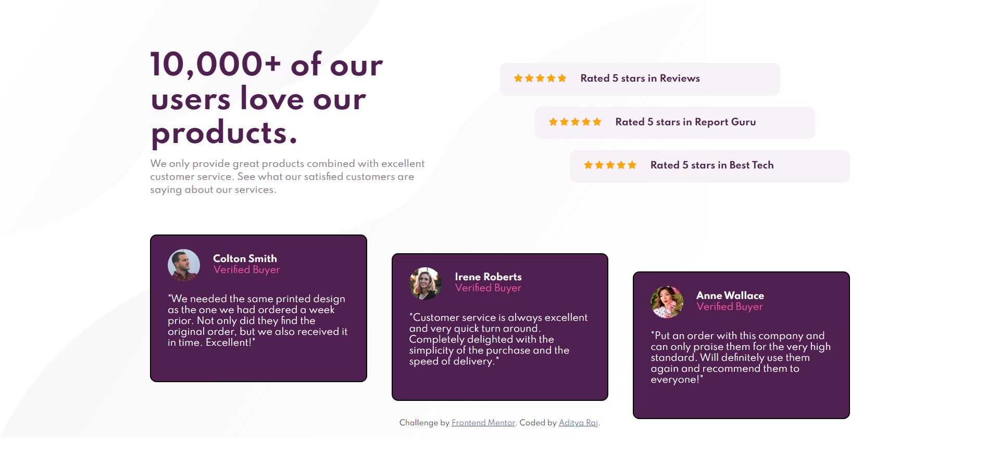

# Frontend Mentor - Social proof section solution
## Live Site URL: [Social proof section URL](https://adityaraj5200-social-proof-section.netlify.app/)

This is a solution to the [Social proof section challenge on Frontend Mentor](https://www.frontendmentor.io/challenges/social-proof-section-6e0qTv_bA). Frontend Mentor challenges help you improve your coding skills by building realistic projects. 

## Table of contents

- [Overview](#overview)
  - [The challenge](#the-challenge)
  - [Screenshot](#screenshot)
  - [Links](#links)
- [My process](#my-process)
  - [Built with](#built-with)
- [Author](#author)

## Overview

### The challenge

Users should be able to:

- View the optimal layout for the section depending on their device's screen size

### Screenshot

### Links

- Solution URL: [Solution URL](https://www.frontendmentor.io/solutions/social-proof-section-with-different-css-for-pcs-and-phones-V5oqlV94G)
- Live Site URL: [Social proof section URL](https://adityaraj5200-social-proof-section.netlify.app/)

## My process

Since this needed to be PCs as well as mobile friendly so I first applied the common CSS for both,
then I wrote the CSS for PC/laptops and CSS for Mobiles/Tablets and applied them using Media Query.

### Built with

- Semantic HTML5 markup
- CSS custom properties
- Flexbox

## Author

- Website - [NULL](https://www.your-site.com)
- Frontend Mentor - [@adityaraj5200](https://www.frontendmentor.io/profile/adityaraj5200)
- Twitter - [@adityaraj5200](https://www.twitter.com/adityaraj5200)
